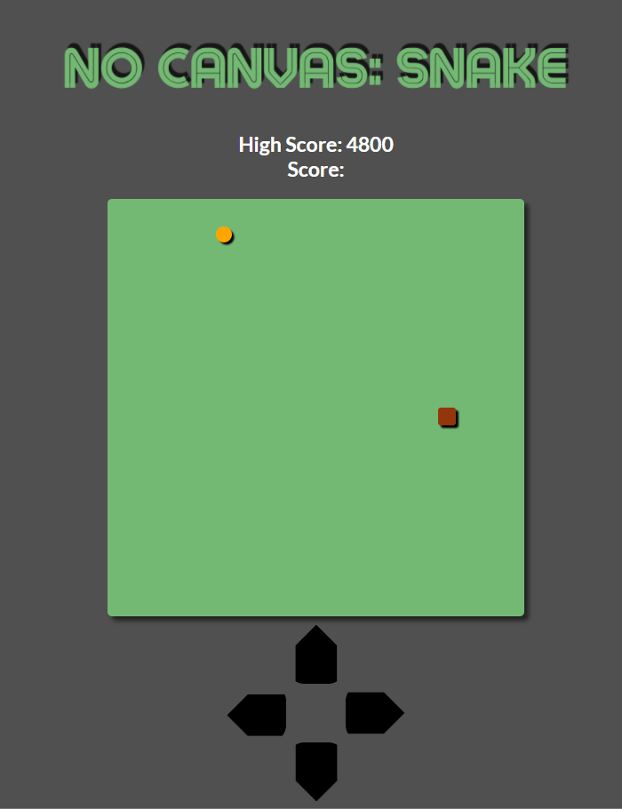

# No Canvas Snake
 Inplementation of the game "Snake" in JS, without relying on Canvas

 The ideia is to use HTML, CSS and JS, to make a functional Snake game.
 Only Mozzila' MDN documentation will be consulted (no other games or game algorithms).

 For being considered functional the game must have the following features:

- [x] Map with well defined edges.
- [x] System of random spawning of fruit in the field that consider the position and size of the snake on the field.
- [x] Snake Player Character. It grows when eating fruits and dies if touch itself or the edges of the map.
- [x] Every fruit adds 1 "pixl" of length for the snake and give some points to the player
- [x] The body of the snake must follow the exctly same path as the head through out the intire field
- [x] The snake must walk in the direction it points until the player change the direction or it collides
- [x] Only moviments to left or right, from the perspective of the snake, is allowed.

## Status: finished

